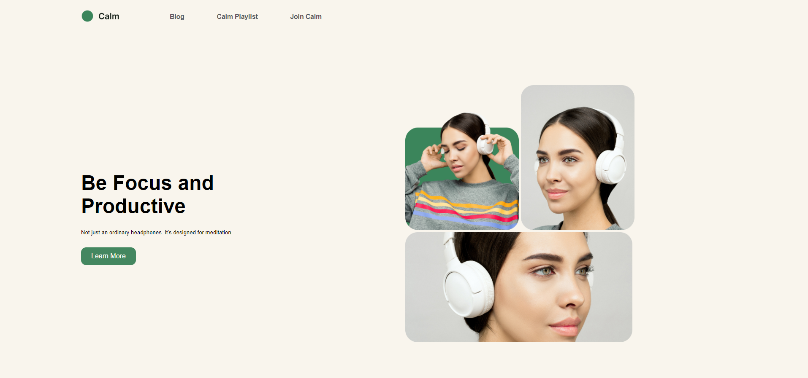

# Stay Calm Page
> _by Saloni_

This webpage titled Stay Calm is made using HTML and CSS. As a part of Full Stack JavaScript Bootcamp, its the 4th project introduced by the course provider explaining about different approaches of CSS styling.

 * ## Tech Stack

    
    
    
    

 * ## Knowledge Gained

   1. Writing clean HTML & CSS.
   2. It's a good practice to add proper comments into your code.
   3. Positioning of elements and its complexity.
   4. Implementation of flexbox and its properties
   5. Sometimes setting width of images can be challenging.
   6. It's efficient to select color code from https://uicolorpicker.com/

 * ## Output:

   